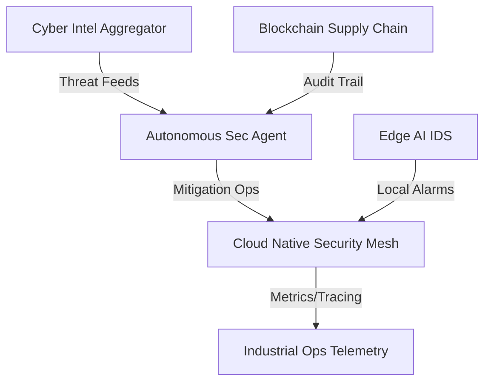

# Industrial Portfolio 2026: Advanced Security & AI Systems

Welcome to the **Industrial Global Launch** repository. This portfolio represents a high-integrity, multi-disciplinary engineering effort focused on mission-critical security, distributed systems, and industrial AI.

## 🏗 System Maillage (Architecture Overview)

## 📂 Project Portfolio (by Domain)

Explore the full inventory of projects categorized by technical domain:

- [🛡️ **CYBER**](./projects/CYBER.md) — Security orchestration, C2, and defensive systems.
- [🧠 **AI**](./projects/AI.md) — Neural networks, RAG systems, and predictive models.
- [⚙️ **SYSTEMS**](./projects/SYSTEMS.md) — Distributed systems, Go/Rust engineering, and cloud-native mesh.
- [🌐 **WEB**](./projects/WEB.md) — Modern frontend and full-stack industrial dashboards.
- [📱 **MOBILE**](./projects/MOBILE.md) — Secure mobile storage and service-based mobile backends.
- [📟 **EMBEDDED**](./projects/EMBEDDED.md) — IoT, sensor networks, and hardware-level automation.
- [📜 **LEGACY**](./projects/LEGACY.md) — Archived experiments and foundational collections.

## 🚀 Technical Matrix: Core Flagships

| Project | Core Stack | Industrial Use-Case | Performance / Feature | Deployment | Status |
| :--- | :--- | :--- | :--- | :--- | :--- |
| **[Cyber Intel Aggregator](./cyber-intel-aggregator-service)** | Rust, Next.js, PG | Dark/Clear Web Intel | Real-time NLP Pipeline | [intel.brainfeed.tech](https://intel.brainfeed.tech) |  |
| **[Edge AI IDS](./edge-ai-intrusion-detection)** | C++, ONNX, gRPC | Critical Infra Protection | < 50us Inference Latency | [Edge Node](https://edge.brainfeed.tech) |  |
| **[Cloud Security Mesh](./cloud-native-security-mesh)** | Go, Redis, eBPF | High-Availability Mesh | Distributed Rate-Limiting | [mesh.brainfeed.tech](https://mesh.brainfeed.tech) |  |
| **[Blockchain Integrity](./blockchain-supply-chain-integrity)** | Rust, ZKP, Substrate | Supply Chain Audit | Zero-Knowledge Verification | [ledger.brainfeed.tech](https://ledger.brainfeed.tech) |  |
| **[Auto-Sec Agent Ops](./autonomous-sec-agent-ops)** | Python, LLM, REST | Autonomous Security SoC | Self-Healing Infrastructure | [agent.brainfeed.tech](https://agent.brainfeed.tech) |  |

## 🛠 Engineering Excellence

- **Deployment**: Production-ready Docker Compose configurations for all services with zero-downtime target.
- **Observability**: Standardized Prometheus metrics and OpenTelemetry tracing across the ecosystem.
- **Architecture**: Modular Domain/Services/Adapters tiered architecture for robust decoupling.
- **Security**: Zero-Trust Asset Identity and Post-Quantum Cryptographic layers integrated into core protocols.

## 🗺 2026 Roadmap

- [x] **Q1: Industrial Global Launch** - Initial flagship deployment and tiered architecture setup.
- [x] **Q1.1: Advanced Logic Integration** - Implementation of ZKP and Distributed Rate-Limiting (Redis).
- [ ] **Q2: Multi-Region Scaling** - Global mesh deployment and advanced NLP model tuning.
- [ ] **Q3: Autonomous Synergy** - Fully autonomous cross-service threat response orchestration.

---
*Maintained by Olivier Robert - Industrial Security Specialist*
*Contact: [olivier.robert@brainfeed.tech](mailto:olivier.robert@brainfeed.tech)*
