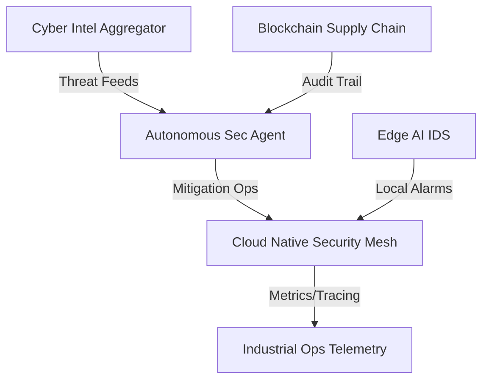

# Industrial Portfolio 2026: Advanced Security & AI Systems

Welcome to the **Industrial Global Launch** repository. This portfolio represents a high-integrity, multi-disciplinary engineering effort focused on mission-critical security, distributed systems, and industrial AI.

## 🏗 System Maillage (Architecture Overview)

## 🚀 Technical Matrix: Core Flagships

| Project | Core Stack | Industrial Use-Case | Performance / Feature | Status |
| :--- | :--- | :--- | :--- | :--- |
| **[Cyber Intel Aggregator](./cyber-intel-aggregator-service)** | Rust, Next.js, PG | Dark/Clear Web Intelligence | Real-time NLP Pipeline | `Active` |
| **[Edge AI IDS](./edge-ai-intrusion-detection)** | C++, ONNX, gRPC | Critical Infra Protection | < 50us Inference Latency | `Stable` |
| **[Cloud Security Mesh](./cloud-native-security-mesh)** | Go, Redis, eBPF | High-Availability Mesh | Distributed Rate-Limiting | `Active` |
| **[Blockchain Integrity](./blockchain-supply-chain-integrity)** | Rust, ZKP, Substrate | Supply Chain Audit | Zero-Knowledge Verification | `Enhanced` |
| **[Auto-Sec Agent Ops](./autonomous-sec-agent-ops)** | Python, LLM, REST | Autonomous Security SoC | Self-Healing Infrastructure | `Stable` |

## 🛠 Engineering Excellence

- **Deployment**: Production-ready Docker Compose configurations for all services.
- **Observability**: Standardized Prometheus metrics and OpenTelemetry tracing across the ecosystem.
- **Documentation**: Comprehensive ADRs (Architecture Decision Records) for every critical design choice.
- **Security**: Zero-Trust Asset Identity and Post-Quantum Cryptographic layers integrated into core protocols.

## 🗺 2026 Roadmap

- [x] **Q1: Industrial Global Launch** - Initial flagship deployment and tiered architecture setup.
- [ ] **Q2: Deep Complexification** - Integration of ZKP and Distributed Rate-Limiting.
- [ ] **Q3: Scaling & Optimization** - Multi-region mesh deployment and advanced NLP model tuning.
- [ ] **Q4: Ecosystem Synergy** - Fully autonomous cross-service threat response orchestration.

---
*Maintained by Olivier Robert - Industrial Security Specialist*
*Contact: [olivier.robert@brainfeed.tech](mailto:olivier.robert@brainfeed.tech)*
